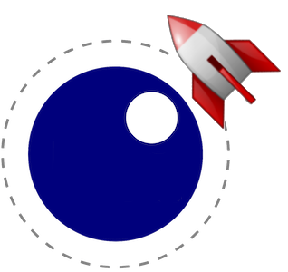

# foguete
Luajit demo framework based on rocket



Foguete is Portuguese for 'rocket'. It provides a Luajit module for interacting with [rocket](https://github.com/emoon/rocket) and all the pieces for creating a graphical demo with synched music.

## Instructions

### Graphics

Launch the `main_glfw` app with the `debug` parameter. Use the mouse to rotate objects and ctrl-tab/shift-ctrl-tab to browse scenes.

```
luajit main_glfw.lua debug
```

Add new scene files to `graphics.lua` here: [graphics.lua#L33](https://github.com/jimbo00000/foguete/blob/master/scene/graphics.lua#L33)


### Choreography

Launch the editor app: `bin/GLeditor.exe`.  
From there, open the file `keyframes/kfs.rocket`.  
Launch the `main_demo` app with the `sync` parameter: `bin\windows\luajit main_demo.lua sync`  
Play back the demo by pressing space in the editor.  
Add a new variable to a scene module (module scoped for external access).  
Add a new keyframe handler to `graphics.lua` here: [graphics.lua#L230](https://github.com/jimbo00000/foguete/blob/master/scene/graphics.lua#L230)  

Press space in the editor to play/pause.  
Scrub with the mousewheel.  
Edit.  
Repeat.  


### Release

```
luajit main_demo.lua compo
```
